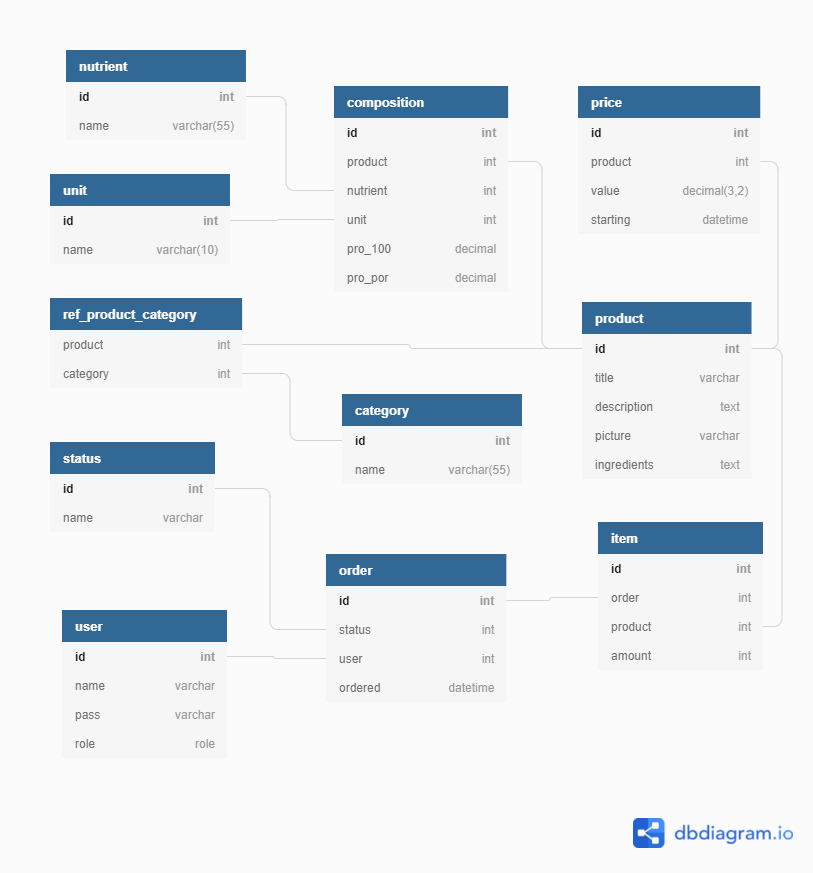

# MAKK

> "Datenbanken II" Module project. MAKK is an 
> order-taking system of a fast-food joint. With 
> separate interfaces, it allows customers to 
> order food and receptionist to take and monitor
> all orders. System uses JavaFX as a GUI and MS 
> SQL Server as a database and developed only as
> a simulation of business process.

